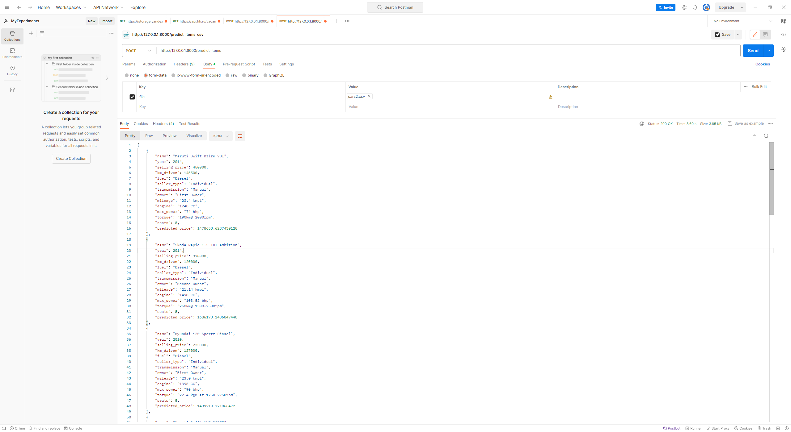
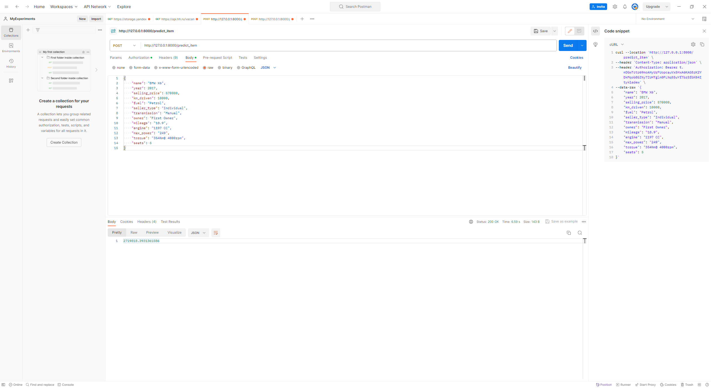

<h1>Что было сделано и с какими результатами</h1>

<ol>
  <li>Проведен простой разведочный анализ данных и обработка признаков </li>
 <ol>
      <li>Убрал дубликаты</li>
      <li>Привел типы</li>
      <li>Преобразовал столбец torque и разбил его на 2</li>
      <li>Заполнил пропуски медианами</li>
    </ol>
  <li>Проанализировал полученные данные визуально /li>
 <ol>
      <li>Через попарный scatterplot</li>
      <li>heatmap для матрицы кореляций</li>
      <li>Scatter plot по отдельным признакам</li>
      <li>Узнал,занимательный факт, что крутящий момент у Maruti Zen D почти такойже как на 6 литровой BMW X6</li>
      <li>Также заметил, что в данных присутствовали шумы</li>
    </ol>
  <li>Посмотрел модель на только вещественных признаках</li>
<ol>
      <li>Отмасштабировали фичи через StandartScaler</li>
      <li>r2_score на test получился 0.5978055282398732</li>
      <li>Попробовал различные регрессионные модели</li>
      <li>Познакомился с GridSearchCV и тем как подбирать коэфициенты</li>
      <li>Другие модели +- дали такой же результат как и обычная линейная регрессия </li>
    </ol>
  <li>Поработал с категориальными признаками</li>
<ol>
      <li>После кодирования категориальных признаков и подбора коэффициентов на гребневой регрессии r2_score получился
        0.6162084989519162 </li>
      <li>Затем решил попробовать бинаризировать часть категориальных признаков</li>
        <li>Удалил часть признаков, которые были связаны с другими признакми, либо не имели больших весов</li>
      <li>Также преобразовал поле name получив брэнд машины и закодировал оставшиеся признаки pd.get_dummies</li>
      <li>После данных действией получил r2_score на test 0.7794117664758615</li>
    </ol>
  <li>Реализовал сервис на FAST-API</li>
<ol>
      <li>Сохранил свою лучшую модель в pickle файл, также сохранил схему колонок после pd.get_dummies </li>
      <li>Реализовал сервис в соответсвие с описанием и темплейтом</li>
        <li>Проверил работу методов 
        
</li>
    </ol>
</ol>

<h1>Что дало наибольший буст в качестве и что не получилось</h1>

 Наибольший прирост в качестве дала работа с категориальными признаками. Не успел поработать с polynomialfeatures.
Скорее всего какой-то прирост могла бы дать детальная работа с выбросами в данных и например вместо заполнения медианной
попробовать заполнить значения через ML. Интересная идея была с подсчетом лошадей на литр.
В процессе работы возникла мысль, что курс по ML OPS начало очень полезен в контексте автоматизации pipeline подобных
активностей. И например можно написать таски для разных подходов к обработке данных + таски с применением разных ML
моделей. И в итоге в рамках одного пайплайна сравнить как работают модели при разных подходах к обработке данных.
Из чего возможно сделать вывод для какой модели какой подход к обрабтке данных лучше.

<h2>Запуск сервиса</h2>
Для запуска сервиса можно выполнить команду  <code> uvicorn mlservice:app</code>
По умолчанию сервис запуститься 127.0.0.1:8000